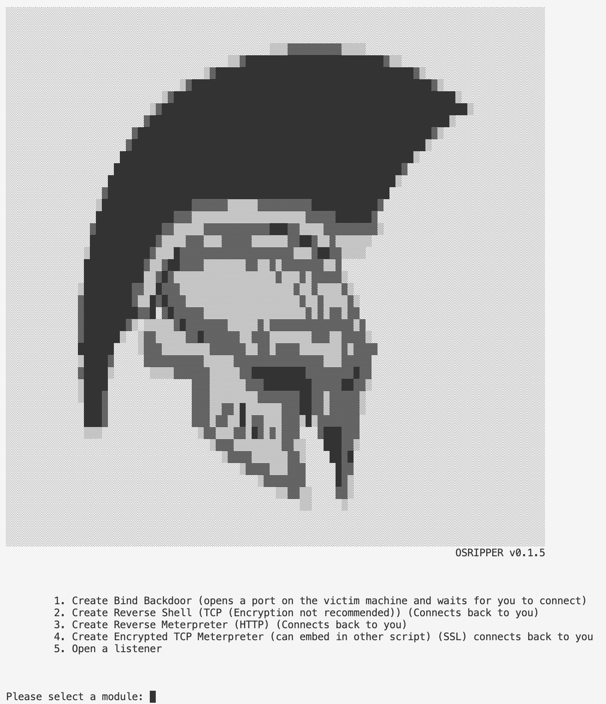
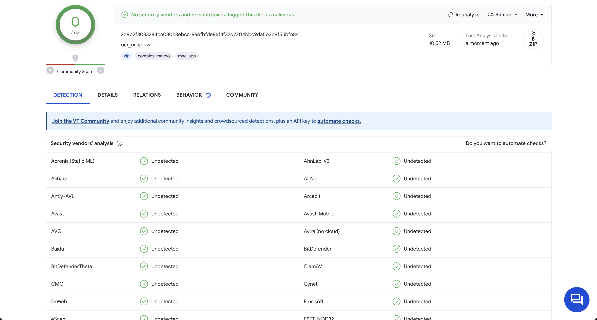

# OSripper


OSripper is a Backdoor generator which specialises in evasion. (Fully undetectable at some levels) 

## Description

OSripper not only generates backdoors but also obfuscates and compiles them. This also includes apple M1 backdoors. Take a closer look at the Roadmap to see how close we are to achieving our goal of total evasion but the results so far are extremely good. In the future i will definetly develop some more specialised and sophisticated Backdoors.

Here are example backdoors which were generated with OSRipper

)

)

## Getting Started

### Dependencies

You only need python. If you do not wish to download python you can download a compiled release.
The python dependencies are specified in the requirements.txt file


## Installing
### Linux
```bash
apt install git python -y
git clone https://github.com/3subs/OSRipper.git
cd OSRipper
pip3 install -r requirements.txt
```
### Windows
```bash
git clone https://github.com/3subs/OSRipper.git
cd OSRipper
pip3 install -r requirements.txt
```
or download the latest release from https://github.com/3subs/OSRipper/releases/tag/v0.1.3

### Executing program
Only this
```
python3 main.py
```
<!-- ROADMAP -->
## Roadmap
- [x] Get down detection to 0/26 on antiscan.me
- [ ] Add Changelog
- [ ] Add More Backdoor templates
- [x] Get down detection to at least 0/68 on VT (for mac malware)

## Help

Just open a issue and ill make sure to get back to you

## Version History


* 0.1
    * Initial Release

## License

This project is licensed under the MIT License - see the LICENSE.md file for details

## Acknowledgments

Inspiration, code snippets, etc.
* [htr](https://github.com/htr-tech/PyObfuscate)


